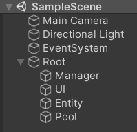
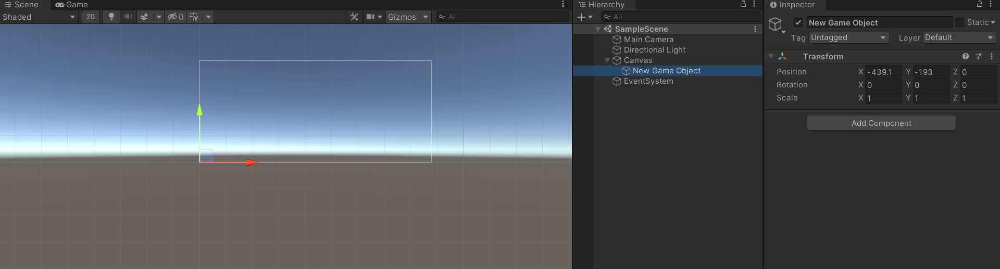

# 框架大体结构

## 场景结构



## 框架UML图


---

# BuildTool 打包工具


记录文件列表如下：

```
Assets/BuildResources/UI/Prefab/TestUI.prefab|ui/prefab/testui.prefab.ab|Assets/BuildResources/UI/Res/3.png|Assets/BuildResources/UI/Res/1.png
```
以``|``符号分割，[0] = 资源名，[1] = Bundle名，后面的都是依赖

---

# GameStart 框架入口

框架入口，挂载到Root节点，读取文件列表，初始化lua等

```csharp
using UnityEngine;

public class GameStart : MonoBehaviour
{
    public GameMode GameMode;
    public bool OpenLog;

    void Start()
    {
        // 订阅lua初始化完成事件
        Manager.Event.Subscribe(10000,OnLuaInit);

        AppConst.GameMode = this.GameMode;
        AppConst.OpenLog = this.OpenLog;
        DontDestroyOnLoad(this);

        // 读取并解析文件列表
        Manager.Resource.ParseVersionFile();
        // 初始化lua
        Manager.Lua.Init();
    }

    void OnLuaInit(object args)
    {
        Manager.Lua.StartLua("main");
        var func = Manager.Lua.LuaEnv.Global.Get<XLua.LuaFunction>("Main");
        func.Call();

        Manager.Pool.CreateGameObjectPool("UI", 10);
        Manager.Pool.CreateGameObjectPool("Monster", 120);
        Manager.Pool.CreateGameObjectPool("Effect", 120);
        Manager.Pool.CreateAssetPool("AssetBundle", 10);
    }
}
```

---

# Manager类

存储所有模块脚本，持有所有模块，所有模块的入口，挂载到Manager节点


在Awake中初始化所有模块
```csharp
private void Awake()
{
    _resource = this.gameObject.AddComponent<ResourceManager>();
    _lua = this.gameObject.AddComponent<LuaManager>();
    _ui = this.gameObject.AddComponent<UIManager>();
    _entity = this.gameObject.AddComponent<EntityManager>();
    _scene = this.gameObject.AddComponent<SceneManager>();
    _sound = this.gameObject.AddComponent<SoundManager>();
    _event = this.gameObject.AddComponent<EventManager>();
    _pool = this.gameObject.AddComponent<PoolManager>();
    _net = this.gameObject.AddComponent<NetManager>();
}
```

---

# 资源加载与卸载流程

## 加载


## 卸载


---

# ResourceManager资源管理器

解析文件列表，加载ab，并对外提供加载各种类型资源的方法。内部使用引用计数，在外部定时卸载引用计数为0的资源。包括编辑器模式加载和Bundle模式加载两种方式。


## ParseVersion 解析版本文件

解析版本文件，缓存解析出的ab和依赖

```csharp
public void ParseVersionFile()
{
    // 版本文件路径
    string url = Path.Combine(PathUtil.BunldeResourcePath, AppConst.FileListName);
    var data = File.ReadAllLines(url);

    for (int i = 0; i < data.Length; i++)
    {
        // 解析Bunlde信息
        var bundleInfo = new BundleInfo();
        string[] info = data[i].Split('|');
        bundleInfo.AssetsName = info[0];
        bundleInfo.BunldeName = info[1];
        bundleInfo.Dependence = new List<string>(info.Length - 2);
        for (int j = 2; j < info.Length; j++)
        {
            bundleInfo.Dependence.Add(info[j]);
        }
        // 缓存Bundle信息
        m_BundleInfos.Add(bundleInfo.AssetsName, bundleInfo);
        // 缓存lua文件名，用于加载lua脚本
        if (info[0].IndexOf("LuaScripts") > 0)
        { 
            Manager.Lua.LuaNames.Add(info[0]);
        }
    }
}
```

## 对外提供的Load方法

根据加载的资源类型，从不同的目录中加载文件

```csharp
public void LoadUI(string assetName, Action<UObject> onComplate)
{
    LoadAssetAsync(PathUtil.GetUIPath(assetName), onComplate);
}

public void LoadMusic(string assetName, Action<UObject> onComplate)
{
    LoadAssetAsync(PathUtil.GetMusicPath(assetName), onComplate);
}

public void LoadSound(string assetName, Action<UObject> onComplate)
{
    LoadAssetAsync(PathUtil.GetSoundPath(assetName), onComplate);
}

public void LoadEffect(string assetName, Action<UObject> onComplate)
{
    LoadAssetAsync(PathUtil.GetEffectPath(assetName), onComplate);
}

public void LoadScene(string assetName, Action<UObject> onComplate)
{
    LoadAssetAsync(PathUtil.GetScenePath(assetName), onComplate);
}
public void LoadLua(string assetName, Action<UObject> onComplate)
{
    LoadAssetAsync(assetName, onComplate);
}
public void LoadPrefab(string assetName, Action<UObject> onComplate)
{
    LoadAssetAsync(assetName, onComplate);
}
```

## LoadAssetAsync 异步加载资源

根据模式，区分是从Edior中加载还是从Bundle中加载

```csharp
private void LoadAssetAsync(string assetName, Action<UObject> onComplate)
{
    if (AppConst.GameMode == GameMode.EditorMode)
        EditorLoadAsset(assetName, onComplate);
    else
        StartCoroutine(LoadBunldeAsync(assetName, onComplate));
}
```

## EditorLoadAsset 编辑器模式下加载

这里用到了``AssetDatabase.LoadAssetAtPath``API去加载项目中的资源

```csharp
private void EditorLoadAsset(string assetName, Action<UObject> onComplate)
{
#if UNITY_EDITOR
    var obj = AssetDatabase.LoadAssetAtPath<UObject>(assetName);
    if (obj == null)
        Debug.LogError("asset name is not exist:" + assetName);
    onComplate?.Invoke(obj);
#endif
}
```

## GetBundle 从已加载的缓存中获取Bundle

注意，这里从缓存中获取bundle，如果缓存中有，返回Bundle并且引用计数+1

```csharp
BundleData GetBundle(string name)
{
    if(m_LoadedAssetBundle.TryGetValue(name,out var bundle))
    {
        bundle.Count++;
        return bundle;
    }
    return null;
}
```

## LoadBunldeAsync 异步加载Bundle

**从读取AB文件到实例化至场景中，需要经历一下几个步骤：**

1. 读取AB文件
2. 加载AB文件中的Bundle资源
3. 实例化Bundle

**这里分了如下几步去加载Bundle：**

1. 先从缓存中获取，如果缓存中有，加载Bundle，并且引用计数+1
2. 缓存中没有，从资源池获取。如果资源池有，从资源池中取出Bundle，加载这个Bundle并且引用计数+1
3. 缓存和资源池中都没有，根据传入的路径读取ab文件，加载这个Bundle，并且缓存起来，同时引用计数也要+1

**这里有几个需要注意的点：**

> 加载Bundle文件时，必须要先加载Bundle的依赖文件。
> 场景文件不需要加载Bundle。
> 依赖文件也不需要加载Bundle。

```csharp
private IEnumerator LoadBunldeAsync(string assetName, Action<UObject> onComplate = null)
{
    var bunldeName = m_BundleInfos[assetName].BunldeName;
    var bundlePath = Path.Combine(PathUtil.BunldeResourcePath, bunldeName);
    var dependences = m_BundleInfos[assetName].Dependence;

    BundleData bundle = GetBundle(bunldeName);
    if (bundle == null)
    {
        var obj = Manager.Pool.Spawn("AssetBundle",bunldeName);
        if (obj != null)
        {
            var ab = obj as AssetBundle;
            bundle = new BundleData(ab);
        }
        else
        {
            // 加载依赖
            if (dependences != null && dependences.Count > 0)
            {
                foreach (var dependence in dependences)
                {
                    yield return LoadBunldeAsync(dependence);
                }
            }
        
            // 加载bundle
            AssetBundleCreateRequest request = AssetBundle.LoadFromFileAsync(bundlePath);
            yield return request;
            bundle = new BundleData(request.assetBundle);
            m_LoadedAssetBundle.Add(bunldeName, bundle);
        }
    }

    // 场景资源不需要加载ab
    if (assetName.EndsWith(".unity"))
    {
        onComplate?.Invoke(null);
        yield break;
    }

    // 加载依赖资源不需加载bundle
    if (onComplate == null)
    {
        yield break;
    }
    // 加载bundle中的资源
    AssetBundleRequest bunldeRequest = bundle.Bundle.LoadAssetAsync(assetName);
    yield return bunldeRequest;

    onComplate?.Invoke(bunldeRequest?.asset);
}
```

## MinusOneBundleCount 减去一个资源的引用计数

这里分两种情况：
- Bundle的引用计数``>1``时，只做-1
- Bundle的引用计数``<=0``时，把Bundle放入资源池，等待资源池的定时释放

```csharp
private void MinusOneBundleCount(string bundleName)
{
    if (m_LoadedAssetBundle.TryGetValue(bundleName, out var bundle))
    {
        if (bundle.Count > 0)
        {
            bundle.Count--;
        }

        if (bundle.Count <= 0)
        {
            Manager.Pool.UnSpawn("AssetBundle",bundleName,bundle.Bundle);
            m_LoadedAssetBundle.Remove(bundleName);
        }
    }
}
```
## MinusBundleCount 减去资源的引用计数

这里需要对自身的引用数-1的同时，对引用的依赖的引用计数也要-1
这个函数对外提供，在销毁一个对象时，手动调用一下引用计数-1

```csharp
public void MinusBundleCount(string assetName)
{
    string bundleName = m_BundleInfos[assetName].BunldeName;
    MinusOneBundleCount(bundleName);

    // 依赖资源
    var dependences = m_BundleInfos[assetName].Dependence;
    if (dependences != null)
    {
        foreach (var dep in dependences)
        {
            string name = m_BundleInfos[dep].BunldeName;
            MinusBundleCount(name);
        }
    }
}
```
## UnloadBundle卸载Bundle资源

```csharp
public void UnloadBundle(UObject obj)
{
    var ab = obj as AssetBundle;
    ab.Unload(true);
}
```
---
# PoolManager 池管理器

池管理类，框架对资源池的设计思想是：可以有多个对象池和引用池，开发者可以自行按照类型去分类


## CreatePool 创建对象池

创建一个指定类型的池，所有创建的池都放在``Root/Pool/*``节点下

```csharp
private void CreatePool<T>(string poolName, float releaseTime) where T : PoolBase
{
    if (!m_Pools.TryGetValue(poolName, out var pool))
    {
        var go = new GameObject(poolName);
        go.transform.SetParent(m_Parnt);
        pool = go.AddComponent<T>();
        pool.Init(releaseTime);
        m_Pools.Add(poolName,pool);
    }
}
```
## CreateGameObjectPool 创建对象池

对外提供的方法，创建一个存储GameObject的池

```csharp
public void CreateGameObjectPool(string poolName, float releaseTime)
{
    this.CreatePool<GameObjectPool>(poolName, releaseTime);
}
```

## CreateAssetPool 创建资源池

对外提供的方法，创建一个存储Bundle资源的池

```csharp
public void CreateAssetPool(string poolName, float releaseTime)
{
    this.CreatePool<AssetPool>(poolName, releaseTime);
}
```

## Spawn 生成对象

对外提供的方法

```csharp
public Object Spawn(string poolName, string assetName)
{
    if (m_Pools.TryGetValue(poolName, out var pool))
    {
        return pool.Spawn(assetName);
    }

    return null;
}
```

## UnSpawn 回收对象

对外提供的方法

```csharp
public void UnSpawn(string poolName, string assetName, Object asset)
{
    if (m_Pools.TryGetValue(poolName, out var pool))
    {
        pool.UnSpawn(assetName,asset);
    }
}
```

## PoolBase类

所有池类的父类

### 定时释放资源

内部维护一个释放时间间隔，定时释放池内资源

```csharp
private void Update()
{
    if (System.DateTime.Now.Ticks - m_LastReleaseTime >= m_ReleaseTime * 10000000)
    {
        m_LastReleaseTime = System.DateTime.Now.Ticks;
        Release();
    }
}
```

## GameObjectPool 类

对象池，释放资源时，需要调用引用计数-1

```csharp
public override void Release()
{
    base.Release();
    for (int i = 0; i < m_Objects.Count; i++)
    {
        while (i < m_Objects.Count &&
                System.DateTime.Now.Ticks - m_Objects[i].LastUseTime.Ticks >= m_ReleaseTime * 10000000)
        {
            Destroy(m_Objects[i].Object);
            Manager.Resource.MinusBundleCount(m_Objects[i].Name);
            m_Objects.Remove(m_Objects[i]);
        }
    }
}
```

## AssetPool类

资源池，定时卸载不用的Bundle

```csharp
public override void Release()
{        
    for (int i = 0; i < m_Objects.Count; i++)
    {
        while (i < m_Objects.Count &&
                System.DateTime.Now.Ticks - m_Objects[i].LastUseTime.Ticks >= m_ReleaseTime * 10000000)
        {
            Debug.Log($"卸载ab{m_Objects[i].Name}");
            Manager.Resource.UnloadBundle(m_Objects[i].Object);
            m_Objects.Remove(m_Objects[i]);
        }
    }
}
```
---
# LuaManager Lua管理器

初始化Lua虚拟机，加载Lua脚本


## Init 初始化

对外提供的方法，在``GameStart``中调用

**这里做以下几件事:**
1. 初始化Lua虚拟机
2. 添加第三方库
3. 添加自定义Loader
4. 加载所有的Lua脚本

```csharp
public void Init()
{
    LuaEnv = new LuaEnv();
    LuaEnv.AddBuildin("rapidjson", XLua.LuaDLL.Lua.LoadRapidJson);
    LuaEnv.AddLoader(Loader);
    m_LuaScript = new Dictionary<string, byte[]> ();
    if (AppConst.GameMode == GameMode.EditorMode)
    {
        EditorLoadLuaScript();
    }
    else
    {
        LoadLuaScript();
    }
}
```

## Update

调用Xlua的Tick函数，进行GC

```csharp
private void Update()
{
    LuaEnv?.Tick();
}
```

## OnDestroy

释放lua虚拟机

```csharp
private void OnDestroy()
{
    if (LuaEnv != null)
    { 
        LuaEnv.Dispose();
        LuaEnv = null;
    }
}
```

## StartLua

执行Lua脚本，一般只调用一次，执行lua的main脚本
```csharp
public void StartLua(string luaFileName)
{
    LuaEnv.DoString($"require '{luaFileName}'");
}
```

## EditorLoadLuaScript 编辑器模拟下加载所有的Lua脚本

```csharp
private void EditorLoadLuaScript()
{
    var luaFiles = Directory.GetFiles(PathUtil.LuaPath, "*.bytes", SearchOption.AllDirectories);
    foreach (var luaFile in luaFiles)
    {
        var fileName = PathUtil.GetStandardPath(luaFile);
        var file = File.ReadAllBytes(fileName);
        AddLuaScript(PathUtil.GetUnityPath(fileName), file);
    }
    Manager.Event.Fire(10000);
}
```

## LoadLuaScript 从Bundle中加载所有的Lua脚本
```csharp
private void LoadLuaScript()
{
    foreach (var luaName in LuaNames)
    {
        Manager.Resource.LoadLua(luaName, (UnityEngine.Object obj) =>
        {
            AddLuaScript(luaName, (obj as TextAsset)?.bytes);
            if (m_LuaScript.Count < LuaNames.Count) return;
            Manager.Event.Fire(10000);
            LuaNames.Clear();
            LuaNames = null;
        });
    }
}
```

## AddLuaScript 缓存lua脚本
主要是避免在Loader中重复读取脚本
```csharp
private void AddLuaScript(string assetsName, byte[] luaScript)
{
    m_LuaScript[assetsName] = luaScript;
}
```

## GetLuaScript 自定义Loader
```csharp
public byte[] GetLuaScript(string luaFileName)
{
    luaFileName = luaFileName.Replace(".", "/");
    var fileName = PathUtil.GetLuaScriptPath(luaFileName);

    if (!m_LuaScript.TryGetValue(fileName, out var luaScript))
    {
        Debug.Log($"lua script is not exist:{fileName}");
    }
    return luaScript;
}
```

## LuaBehaviour类
绑定lua脚本，提供类似MonoBehaviour的生命周期。
同时也是所有需要在lua中挂载的脚本的父类。
### Awake
为每一个lua脚本创建单独的环境，防止各脚本之前相互影响
```csharp
private void Awake()
{
    m_ScriptEnv = m_LuaEnv.NewTable();
    var meta = m_LuaEnv.NewTable();
    meta.Set("__index", m_LuaEnv.Global);
    m_ScriptEnv.SetMetaTable(meta);
    meta.Dispose();
    m_ScriptEnv.Set("self", this);
}
```

### Init
初始化，绑定生命周期的回调
```csharp
public virtual void Init(string luaName)
{
    m_LuaEnv.DoString(Manager.Lua.GetLuaScript(luaName), luaName, m_ScriptEnv);
    m_ScriptEnv.Get("OnInit",out m_LuaOnInit);
    m_ScriptEnv.Get("Update",out m_LuaUpdate);
    m_ScriptEnv.Get("OnDestroy",out m_LuaOnDestroy);       
    m_LuaOnInit?.Invoke(); 
}
```

### Update
调用lua中的Update
```csharp
private void Update()
{
    m_LuaUpdate?.Invoke();
}
```

### OnDestroy
调用lua中的OnDestroy
清空绑定的回调，释放脚本环境
```csharp
private void OnDestroy()
{
    m_LuaOnDestroy?.Invoke();
    Clear();
}
```

### OnApplicationQuit
清空绑定的回调，释放脚本环境
```csharp
private void OnApplicationQuit()
{
    Clear();
}
```

### Clear
清空绑定的回调，释放脚本环境
**值得注意的是**
> 释放lua虚拟机时，必须要先清空绑定的lua回调

```csharp
protected virtual void Clear()
{
    m_LuaOnInit = null;
    m_LuaUpdate = null;
    m_LuaOnDestroy = null;
    m_ScriptEnv?.Dispose();
    m_ScriptEnv = null;
}
```


### OnDestroy

---
# UIManager UI管理器
管理所有的UI，包括：UI分组、打开关闭UI


## SetUIGroup
所有的UI分组都是动态创建的，UI分组脚本挂载到Root/UI/Group-*上
```csharp
public void SetUIGroup(List<string> group)
{
    for (int i = 0; i < group.Count; i++)
    {
        var go = new GameObject($"Group-{group[i]}", typeof(RectTransform));
        go.transform.SetParent(m_UIParent,false);
        var rectTransform = go.transform as RectTransform;
        rectTransform.anchorMin = Vector2.zero;
        rectTransform.anchorMax = Vector2.one;
        rectTransform.offsetMin = Vector2.zero;
        rectTransform.offsetMax = Vector2.zero;
        m_UIGroups.Add(group[i], go.transform);
    }
}
```
**这里有一个需要注意的点**
> 1. 通过new的方式创建GameObejct时，把创建好的对象设置到Canvas下，Transform不会自动转成RectTransform，如果不需要修改RectTransform的属性可以忽略
> 2. new出来的对象放到Canvas下时，坐标会默认在屏幕左下角，需要手动设置。



## GetUIGourp 获取UI分组
从缓存里获取，没啥好说的
```csharp
public Transform GetUIGourp(string group)
{
    m_UIGroups.TryGetValue(group, out var go);
    return go;
}
```

## OpenUI 打开UI
打开UI先从对象池读，对象池没有再去实例化一个，实例化的时候通过Bundle缓存、资源池、AB文件获取，整体流程如下：


## UILogic类
继承LuaBehaviour 绑定lua脚本，提供类似MonoBehaviour的生命周期，提供打开、关闭的回调。

### Init 初始化
绑定UI打开和关闭的回调
```csharp
public override void Init(string luaName)
{
    base.Init(luaName);
    m_ScriptEnv.Get("OnOpen", out m_LuaOnOpen);
    m_ScriptEnv.Get("OnClose", out m_LuaOnClose);
}
```

### OnOpen
调用lua中的打开回调
```csharp
public void OnOpen()
{
    m_LuaOnOpen?.Invoke();
}
```

### Close
回收UI到对象池，调用lua中的关闭回调。
隐藏UI在对象池的回收方法中
```csharp
public void Close()
{
    m_LuaOnClose?.Invoke();
    Manager.Pool.UnSpawn("UI", AssetName, this.gameObject);
}
```
**UI关闭到释放资源的流程**


### Clear
清空绑定的打开和关闭的lua回调
```csharp
protected override void Clear()
{
    m_LuaOnOpen = null;
    m_LuaOnClose = null;
    base.Clear();
}
```

# EntityManager 实体管理器
管理所有的实体，包括：实体分组、显示隐藏实体。
与UI管理器不能说毫不相关，只能说一摸一样，详细的可以参考UI管理器及UILogic


---

# SceneManager 场景管理器
管理场景的加载、切换、激活


## LoadScene 叠加加载场景
叠加场景模式加载
```csharp
public void LoadScene(string sceneName, string luaName)
{
    Manager.Resource.LoadScene(sceneName, obj =>
    {
        StartCoroutine(StartLoadScene(sceneName, luaName, LoadSceneMode.Additive));
    });
}
```

**叠加加载场景和加载单个场景的区别**
> 叠加场景加载完场景后不销毁原场景
> 加载单个场景，销毁原场景

## ChangeScene 切换场景
单场景模式加载
```csharp
public void ChangeScene(string sceneName, string luaName)
{
    Manager.Resource.LoadScene(sceneName, obj =>
    {
        StartCoroutine(StartLoadScene(sceneName, luaName, LoadSceneMode.Single));
    });
}
```

## ActiveScene 激活场景
**激活场景**
> 活动场景是将用作新游戏对象（由脚本实例化）的目标的场景，在这些场景中会使用光照设置。以累加方式添加场景时（请参阅 LoadSceneMode.Additive），第一个场景将仍然保持为活动场景。使用此方法可将活动场景切换为您想作为目标的场景。

```csharp
public void ActiveScene(string scenName)
{
    var lastScene = UnityEngine.SceneManagement.SceneManager.GetActiveScene();
    var lastLogic = GetSceneLogic(lastScene);
    lastLogic?.OnUnActive();
    var scene = UnityEngine.SceneManagement.SceneManager.GetSceneByName(scenName);
    UnityEngine.SceneManagement.SceneManager.SetActiveScene(scene);
    var logic = GetSceneLogic(scene);
    logic?.OnActive();
}
```

## UnloadScene 卸载场景
对外提供的卸载场景的方法
```csharp
public void UnloadScene(string sceneName)
{
    StartCoroutine(UnLoadScene(sceneName));
}
```

## StartLoadScene 加载场景的实现
每个场景中都有一个挂载``SceneLogic``脚本的对象继承自``LuaBehaviour``向lua提供场景的生命周期。
通过``MoveGameObjectToScene``API将挂载``SceneLogic``脚本的对象移动到新场景中去
```csharp
private IEnumerator StartLoadScene(string sceneName, string luaName, LoadSceneMode mode)
{
    if (IsLoadedScene(sceneName)) yield break;

    var async = UnityEngine.SceneManagement.SceneManager.LoadSceneAsync(sceneName, mode);
    async.allowSceneActivation = true;
    yield return async;

    var scene = UnityEngine.SceneManagement.SceneManager.GetSceneByName(sceneName);
    var go = new GameObject(m_LogicName);
    UnityEngine.SceneManagement.SceneManager.MoveGameObjectToScene(go, scene);

    var logic = go.AddComponent<SceneLogic>();
    logic.SceneName = sceneName;
    logic.Init(luaName);
    logic.OnEnter();
}
```

## UnLoadScene 卸载场景的实现
异步卸载场景，调用lua的场景退出回调
```csharp
private IEnumerator UnLoadScene(string sceneName)
{
    var scene = UnityEngine.SceneManagement.SceneManager.GetSceneByName(sceneName);
    if (!scene.isLoaded)
    {
        Debug.LogError("Scene not isLoaded");
        yield break; 
    }

    var logic = GetSceneLogic(scene);
    logic?.OnQuit();
    var async = UnityEngine.SceneManagement.SceneManager.UnloadSceneAsync(scene);
    yield return async;
}
```

### SceneLogic类
继承LuaBehaviour给lua提供场景的生命周期
```csharp
using System;

public class SceneLogic : LuaBehaviour
{
    public string SceneName;

    private Action m_LuaOnActive;
    private Action m_LuaOnUnActive;
    private Action m_LuaOnEnter;
    private Action m_LuaOnQuit;

    public override void Init(string luaName)
    {
        base.Init(luaName);
        m_ScriptEnv.Get("OnActive", out m_LuaOnActive);
        m_ScriptEnv.Get("OnUnActive", out m_LuaOnUnActive);
        m_ScriptEnv.Get("OnEnter", out m_LuaOnEnter);
        m_ScriptEnv.Get("OnQuit", out m_LuaOnQuit);
    }

    public void OnActive()
    {
        m_LuaOnActive?.Invoke();
    }

    public void OnUnActive()
    {
        m_LuaOnUnActive?.Invoke();
    }

    public void OnEnter()
    {
        m_LuaOnEnter?.Invoke();
    }

    public void OnQuit()
    {
        m_LuaOnQuit?.Invoke();
    }

    protected override void Clear()
    {
        m_LuaOnActive = null;
        m_LuaOnUnActive = null;
        m_LuaOnEnter = null;
        m_LuaOnQuit = null;
        base.Clear();
    }
}
```

---

# SoundManager 声音管理器
声音分为两种类型，一种是BGM音乐一直循环播放的，一种是音效，只播放一次。
这里的实现是使用两个AudioSource分别播放BGM和音效

这个就比较简单了，没啥好说的直接上代码吧
```csharp
using System.IO;
using UnityEngine;

public class SoundManager : MonoBehaviour
{
    private AudioSource m_MusicAudio;
    private AudioSource m_SoundAudio;

    private float SoundVolume
    {
        get { return PlayerPrefs.GetFloat("SoundVolume", 1.0f); }
        set
        {
            m_SoundAudio.volume = value;
            PlayerPrefs.SetFloat("SoundVolume", value);
        }
    }
    
    private float MusicVolume
    {
        get { return PlayerPrefs.GetFloat("MusicVolume", 1.0f); }
        set
        {
            m_MusicAudio.volume = value;
            PlayerPrefs.SetFloat("MusicVolume", value);
        }
    }

    private void Awake()
    {
        m_MusicAudio = this.gameObject.AddComponent<AudioSource>();
        m_MusicAudio.playOnAwake = false;
        m_MusicAudio.loop = true;

        m_SoundAudio = this.gameObject.AddComponent<AudioSource>();
        m_SoundAudio.loop = false;
    }

    /// <summary>
    /// 播放音乐
    /// </summary>
    /// <param name="name"></param>
    public void PlayMusic(string name)
    {
        if (this.MusicVolume < 0.1f) return;;
        string oldName = "";
        if (m_MusicAudio.clip != null) oldName = m_MusicAudio.clip.name;
        if (oldName == Path.GetFileNameWithoutExtension(name))
        {
            m_MusicAudio.Play();
            return;
        }
        
        Manager.Resource.LoadMusic(name, obj =>
        {
            m_MusicAudio.clip = obj as AudioClip;
            m_MusicAudio.Play();
        });
    }

    /// <summary>
    /// 暂停音乐
    /// </summary>
    public void PauseMusic()
    {
        m_MusicAudio.Pause();
    }

    /// <summary>
    /// 取消暂停音乐
    /// </summary>
    public void UnPauseMusic()
    {
        m_MusicAudio.UnPause();
    }

    /// <summary>
    /// 停止播放音乐
    /// </summary>
    public void StopMusic()
    {
        m_MusicAudio.Stop();
    }

    /// <summary>
    /// 播放声音
    /// </summary>
    /// <param name="name"></param>
    public void PlaySound(string name)
    {
        if (this.SoundVolume < 0.1f) return;
        
        Manager.Resource.LoadSound(name, obj =>
        {
            m_SoundAudio.PlayOneShot(obj as AudioClip);
        });
    }

    /// <summary>
    /// 设置音乐音量
    /// </summary>
    /// <param name="value"></param>
    public void SetMusicVolume(float value)
    {
        this.MusicVolume = value;
    }

    /// <summary>
    /// 设置音效音量
    /// </summary>
    /// <param name="value"></param>
    public void SetSoundVolume(float value)
    {
        this.SoundVolume = value;
    }
}
```

# EventManager 事件管理器
其实就是发布订阅模式


```csharp
using System.Collections.Generic;
using UnityEngine;

public class EventManager : MonoBehaviour
{
    public delegate void EventHandler(object args);

    private Dictionary<int, EventHandler> m_Events = new Dictionary<int, EventHandler>();

    public void Subscribe(int id, EventHandler e)
    {
        if (m_Events.ContainsKey(id))
        {
            m_Events[id] += e;
        }
        else
        {
            m_Events.Add(id, e);
        }
    }

    public void UnSubscribe(int id, EventHandler e)
    {
        if (m_Events.ContainsKey(id))
        {
            if (m_Events[id] != null)
            {
                m_Events[id] -= e;
            }
            else
            {
                m_Events.Remove(id);
            }
        }
    }

    public void Fire(int id, object args = null)
    {
        if (m_Events.TryGetValue(id, out var handler))
        {
            handler(args);
        }
    }
}
```

# NetManager 网络管理器
 ```mermaid
    classDiagram
        class NetManager{
            -NetClient m_NetClient
            -Queue~KeyValuePair<int, string>~ m_MessageQueue
            -LuaFunction ReceiveMessage
            +Init()
            +SendMessage(int messageId, string message)
            +OnConnectedToServer(string host,int port)
            +OnNetConnected()
            +OnDisConnected()
            +Receive(int msgId, string message)
            -Update()
        }
        class NetClient{
            -TcpClient m_Client
            -NetworkStream m_TcpStream
            -const int BufferSize
            -byte[] m_Buffer = new byte[BufferSize]
            -MemoryStream m_MemStream
            -BinaryReader m_BinaryReader
            +NetClient()
            +OnConnectServer(string host, int port)
            +SendMessage(int msgID, string message)
            -OnConnect(IAsyncResult asyncResult)
            -OnRead(IAsyncResult asyncResult)
            -OnDisConnected()
            -ReceiveData()
            -OnEndSend(IAsyncResult asyncResult)
            -RemainingBytesLength()
        }
        NetManager --|> MonoBehaviour : 继承
```