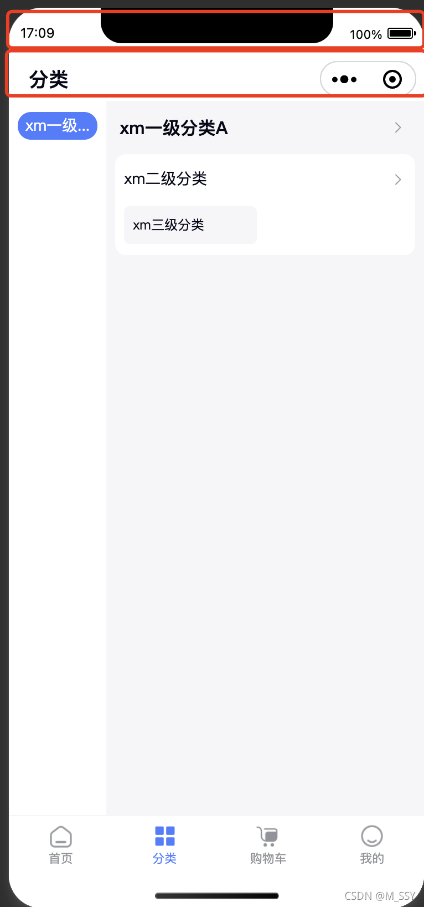

```C#
WX.InitSDK((int code) =>
{
    // 你的主逻辑
    var info = WX.GetSystemInfoSync();
    var systemBarHeight = info.statusBarHeight; // 状态栏高度
    var menu = WX.GetMenuButtonBoundingClientRect();
    var navigationBarHeight = menu.height; // 胶囊栏高度
    float py = ((float)info.windowHeight - (float)(systemBarHeight + navigationBarHeight)) / (float)info.windowHeight;
    // 调整UI根节点Rect
    var rect = UIKit.Root.Common.GetComponent<RectTransform>();
    rect.anchorMax = new Vector2(1, py);
    rect.offsetMax = Vector2.zero;
    rect.offsetMin = Vector2.zero;
});
```