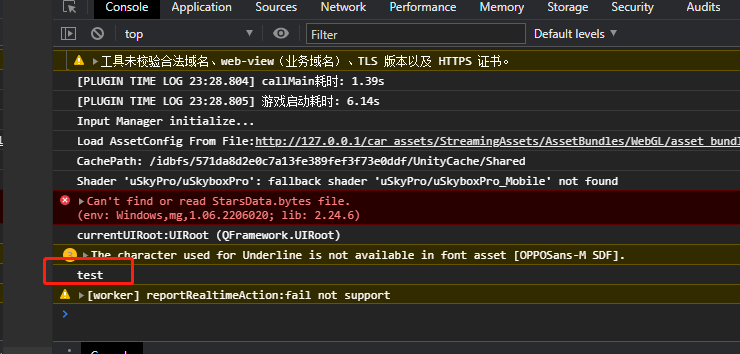
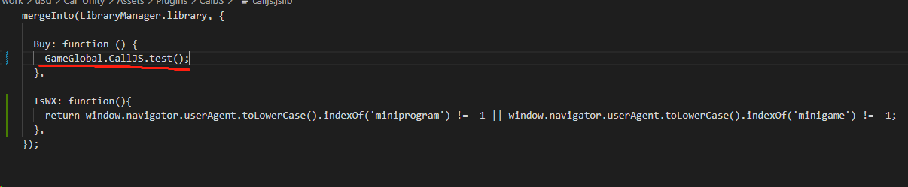

# 微信小游戏JS交互方式：
> 微信小游戏机制问题，在微信小游戏中不会加载index.html，所以写在index.html的函数均不会被调用到

1.自行创建``calljs.js``文件中添加定义，**每次编译该文件都会被覆盖**
```js
export const CallJS={
  test:function(){
    console.log("test");
  }
}
```
2.在``game.js``中引入
```js
import './weapp-adapter'
import unityNamespace from './unity-namespace'
import './webgl.wasm.framework.unityweb'
import "./unity-sdk/index.js"
import checkVersion, {canUseCoverview} from './check-version'
import "texture-config.js";
import {launchEventType} from './plugin-config'
import {CallJS} from './calljs' // 引入自定义JS调用代码
```
挂载到``GameGlobal``对象上，第32行下
```JavaScript
GameGlobal.managerConfig = managerConfig;
GameGlobal.CallJS = CallJS; // 挂载
```
3.调用案例，小游戏侧无需实现，在Unity的胶水层定义
> Unity自定义的胶水层代码会被编译到``webgl.wasm.framework.unityweb.js``中
> 


点击按钮，在Unity中通过胶水层调用``_Buy``函数




# WebGL的JS交互方式：
1.使用和微信小游戏中同样的引入方式，自行定义``GameGlobal``并挂载``CallJS``对象，保持和小游戏中相同的定义方式。在胶水层统一调用，不再做区分处理。





# calljs更新方式建议：
建议在unity中将calljs做模板处理，不需要每次都修改index.html和game.js。只需要替换calljs.js文件即可。
WebGL模板修改``WXTemplate``或``WXTemplate2020``
小游戏模板修改``WX-WASM-SDK\wechat-default``