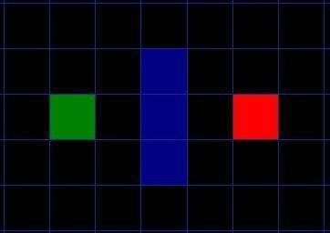
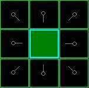
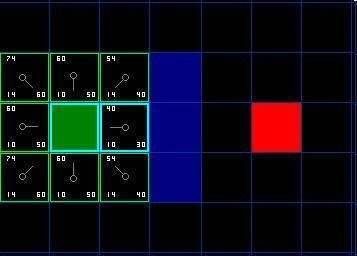
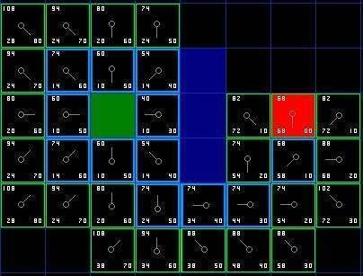
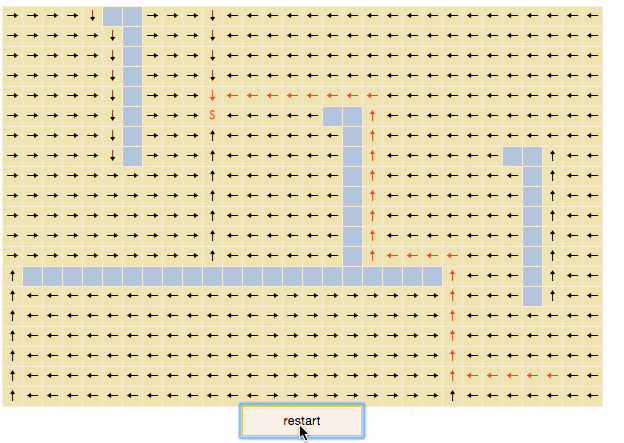
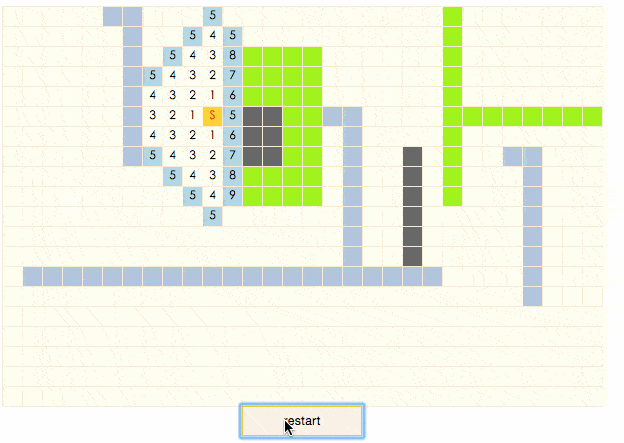

## 简介：搜索区域
绿色是起点A，红色是终点B，蓝色的是障碍物强。假设我们要从A点走到B点。

假设整张地图是搜索区域，那么把整张地图划分为方块状的网格，这样便简化了搜索区域，如此便能用二维数组来表示整张地图。而每一个网格分有可行走和不可行走两个状态。通过从A到B走那些网格来确定路径。
## 开始搜索
上一步我们将地图简化为可管理的二维数组，下一步就是搜索最短路径。搜索方法有点类似与八连通种子填充算法。做法是从A点开始，检查八连通的网格，以此递归向外搜索直到找到目标。

搜索的步骤如下：
1. 创建两个列表，一个是“打开列表”用于存放将要进行搜索，但还没搜索过的网格。另一个是“关闭列表”用于存放已经搜索过的网格。
2. 从起点A开始，将其添加到要进行搜索的“打开列表中”。
3. 查看起点附近八连通的所有可行走的网格，这里要忽略掉添加到“关闭列表”中的网格，已经搜索过的网格不必再次搜索，并且将这些网格的父网格设置A，然后将这些网格添加到“打开列表”中。
4. 从“打开列表”中删除起始网格A，并将其添加到“关闭列表中”。

这时得到如下图所示的内容，其中绿色的方块是起始网格，带有浅蓝色轮廓的是已经添加到关闭列表中的网格，带有浅绿色轮廓的是已经添加到打开列表中的网格并且这些网格都有一个灰色的指针指向其父网格。

接下来，只要选择打开列表中的一个网格，重复执行A点执行过的步骤就可以了。那么我们该选择哪一个方块作为下一个进行八连通搜索的网格呢？看下一步

## 路径评分
在进行下一步选择时，确定使用哪个方块，需要计算一个路径评分或说时代价。公式如下：
> F = G + H
其中
- G是从起点到当前网格的移动代价，或者说是距离。
- H是从当前网格到终点的移动代价或距离。
- F为G和H的和，表示当前网格的总代价。

为了方便计算，我们将两个水平或垂直相邻网格的移动代价设为10，而对角线相邻的网格的移动代价设为14。因为如果以1为水平或垂直移动代价，那么对角线的移动代价为√2，显然这是不利于计算机计算的。

## 继续搜索
接下来要从“打开列表”中选择一个F最低的网格进行下一步的搜索。
在经历过第一轮的搜索后，我们在“打开列表”中存放了8个网格，其中F最低的为右边的网格，所以我们选择这个网格进行下一步的搜索。

1. 将这个网格从“打开列表”中删除并添加到“关闭列表中”
2. 其右边的网格是障碍物，所以忽略其右边的网格。其左边的网格是开始点，已经在删除列表中了，所以也忽略。此时只剩上、下、斜左上和斜左下四个网格。
3. 计算这四个网格的G值，发现从起点到当前网格再走向这四个网格中的任何一个点，其G值都比从起点直接走向这些点大。所以我们对这四个网格不做任何操作。而且这四个网格已经在“打开列表”中，所以我们也不必再次添加。（而当经过此网格的G值比之前的G值低时，要更新其G值，并将其父网格设置为此网格）
4. 此时“打开列表”中只剩下7个网格。

下一步，我们从这7个网格中再找一个F值最小的网格进行下一步的搜索。这时我们发现斜右上和斜右下的F值一样，那么我们选择哪个进行下一步呢？这要取决于你的排序算法，当然这不重要，但是出于速度考虑，可以选择最后一个添加到“打开列表”的网格。。

所以，我们选择再起点右下方的网格。

这一次，当进行八连通搜索时，右边是墙，上边的两个网格已经在“关闭列表”中了，因此忽略这四个网格。这里我们也忽略了墙下方的网格（这是可选的，也可以视为墙下方的网格可以通过，这取决于你要不要选择从墙的切角过去）。

剩下的五个网格中，当前网格下方的两个网格没有在“打开列表”中，因此将其添加进去并且将当前网格设置为这两个网格的父网格。然后计算剩下四个网格的G值。接下来一直重复这个过程就可以了。

## 步骤摘要
1. 将起始网格添加到“开始列表”中。
2. 将网格从“打开列表”中删除并将其添加到“关闭列表中”。
3. 检查所有相邻的网格，忽略障碍、已经在“关闭列表”和其他不可行走的网格。如果他们不在“打开列表”中，则将其添加到列表中设置其父网格为此网格，计算经历此网格到其的G值。如果在“打开列表中”，则计算经历此网格到其的G值，若G值更小，则更新父网格和G值及F值。
4. 重复以下步骤：
 1. 在“打开列表”中查找F值最低的网格，设置为当前网格。
 2. 将其从“打开列表”删除，添加到“关闭列表”
 3. 搜索其八连通网格，忽略障碍、已添加到“关闭列表”的和其他不可行的网格。
  - 对于这些网格，将其添加到“打开列表”中并计算其G值，然后根据G值设置父网格和F值。
  - 选择F值最低的进行下一次搜索。

## 广度优先算法
广度优先算法是最简单的寻路算法，算法执行的结果是获得从地图上任意一点S到其他所有可达点的最短路径，这里只考虑上下左右四方向行走的情况，算法流程非常容易理解：

1. 设定搜索起点S，放入openList中；
2. 判断openList是否为空，若为空，搜索结束；若不为空，拿出openList中的第一个节点G；
3. 遍历G的上下左右四个相邻节点N1-N4，对每个节点N，如果N不在openList或closeList中，那么令N的父节点为G，将N放入openList中；如果N已经在openList或closeList中，跳过不处理；
4. 将G放入closeList中，重复步骤2.

## Dijkstra算法
> 可以视为在A*算法中，只考虑G值而不考虑H。
在地图内的每个区块移动消耗不同时，Dijkstra算法可以非常方便的找出从地图上某个起始区块到其他所有可达区块的最短路径，这里仍然只考虑上下左右四个方向移动的情况，算法流程如下：

说明：起始区块记作S，从S到当前区块G的总移动消耗记作CG，优先队列openList中数据为(G,CG)（区块，S到当前区块总移动消耗）,区块G自身移动消耗记作ZG。

1. 设定起始区块S，将区块S和总移动消耗C=0（记作(S,0)）放入openList，其中openList是一个优先队列(PriorityQueue)，总移动消耗C越低优先级越高；
2. 判断openList是否为空，如果是空，算法结束；否则，从openList中拿出优先级最高的区块G；
3. 遍历G的上下左右四个相邻区块N1-N4，对每个区块N，如果N已经在closeList中，忽略该区块；如果N不可达，忽略该区块；否则会有两种情况:
 1. 如果N不在openList中，那么将(N,CN)放入openList中，其中CN=CG+ZN,既S到N的移动总消耗等于S到G的移动总消耗加上N本身的移动消耗，令N的父节点为G;
 2. 如果N已经在openList中，取出(N,CN)，仍然计算CN1=CG+ZN，如果CN1小于CN，用(N,CN1)替换openList中的(N,CN)，令N的父节点为G；如果CN1大于或等于CN，不做处理。
4. 重复步骤2直至算法结束。

## Greed-Best-First-Search
> 可以视为在A*算法中，只考虑H值而不考虑G值
网上没有找到比较官方的翻译，有人译作“最好优先贪婪算法”，我们暂时这么称呼它。

最好优先贪婪算法与上面两种算法的不同之处在于，它总是尝试向离目标节点更近的方向探索，怎样才算离目标节点更近呢？在只能上下左右四方向移动的前提下，我们通过计算当前节点到目标节点的曼哈顿距离来进行判断。

假设当前节点坐标为(x,y)，目标节点的坐标为(x1,y1)，曼哈顿距离计算公式如下：
> Manhattan_distance = abs(x1-x)+abs(y1-y)
由于曼哈顿距离只在两点之间没有障碍物的情况下才与实际距离相等，一般情况下曼哈顿距离总是小于实际距离。因此，当节点间不存在障碍物时，算法可以保证找出最短路径，但是一旦障碍物出现，最短路径就无法保证了。

算法流程如下：

说明：起始节点记作S，目标节点记作E，对于任意节点G，从当前节点G到目标节点E的曼哈顿距离记作MG，优先队列openList中数据为(G,MG)（节点，当前节点到目标节点E的曼哈顿距离）。

1. 将起始节点S放入openList，openList是一个优先队列，曼哈顿距离越小的节点，优先级越高。
2. 判断openList是否为空，如果为空，搜索失败，目标节点E不可达；如果不为空，从openList中拿出优先级最高的节点G;
3. 遍历节点G的上下左右四个相邻节点N1-N4，如果N在openList或closeList中，忽略节点N；否则，令N的父节点为G，计算N到E的曼哈顿距离MN，将(N,MN)放入openList。
4. 判断节点G是不是目标节点E，如果是，搜索成功，获取节点G的父节点，并递归这一过程（继续获得父节点的父节点），直至找到初始节点S，从而获得从G到S的一条路径；否则，重复步骤2。

## 总结
A*算法中的G就是根据Djkstra算法计算的，而H就是根据最好优先贪婪算法计算的。因此可以将A*视为Djkstra算法和最好优先贪婪算法的结合。
### 四种算法的选择
1. 虽然最优选择贪婪算法只在特定情况下才可以找到最短路径（没有障碍物、没有地形移动消耗差异），但是它的运行速度是最快的。如果情况允许，优先使用本算法。
2. 当需要知道地图上某个点到所有其他点的最短路径，或者反过来，地图上所有点到某个点的最短路径时，选择广度优先算法（各区块移动消耗相同）或Dijkstra算法（各区块移动消耗不同）。
3. 在一般情况下，使用A*算法总是正确的。

## A*算法实现
https://gitee.com/week233/AStartForUnity.git