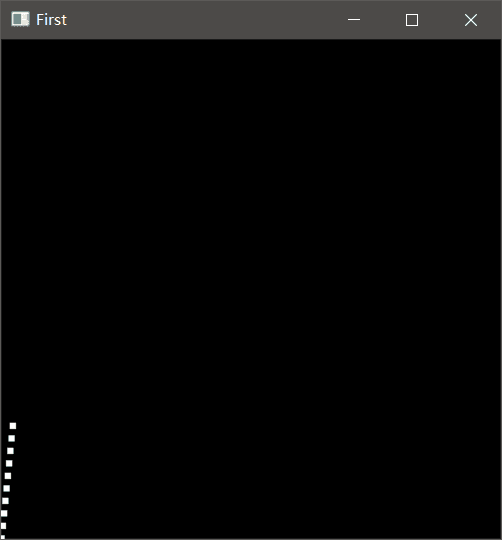

## DDA画线算法
DDA画线算法也叫数值微分算法。其算法原理如下：
### 算法原理
DDA算法的基础就是初中数学中的斜截式方程y=kx+b。
斜率k=Δy/Δx,Δy=y2-y1,Δx=x2-x1。所以k=(y2-y1)/(x2-x1)。这也是斜截式方程的特点。知道坐标系内的任意两点就能求其一元二次方程。
因此，给出一个起点和终点就能画出一条线。
## 算法优化
一元二次方程y=kx+b，可以看出其中用了一个乘法。对于画线算法来说，如果用此方程直接画线，那么每画一个像素点都要计算一个乘法。而在加减乘除中乘法运算的效率是比较慢的，所以直接使用斜截式方程画线的效率太低。要把其中的乘法运算转换成加法运算，因为加法运算是最快的。
### 增量思想
假设x为步长方向，每次加一:
**y** (i)= **kx** (i) **+b**，那么 **y** (i+1)**=kx** (i+1) **+b**。
已知x每次加一,所以,**x** (i+1) **=x** i **+1** ,所以:
**y** (i+1) **=k(x** (i) **+1)** **+b**
**y** (i+1) **=kx** (i) **+k+b**，（y(i)=kx(i)+b）
**y** (i+1) **=y** (i) **+b**
这样就能求出x+1时对应的y值了。
这样做但斜率小于1时，画出的线段时连续的，当斜率大于1时，画出的线段则成离散的了。因为像素点只能是整数，所以需要四舍五入。假设k>1时，当x+1时，y则加kx，肯定是一个1大的整数，因此画出的线段不连续。



### 斜率转换
**(x** (i+1) **-x** (i) **)=Δx**
**(y** (i+1) **-y** (i) **)=Δy**
k=Δy/Δx
y(i)=kx(i),y(i+1)=kx(i+1)=kx(i)+k;
当|k|>1时，以y为步长方向。令Δm=Δy,那么y的增量为Δy/Δm=1,x的增量为Δx/Δm。
当|k|<1时，以x为步长方向。令Δm=Δx,那么x的增量为Δx/Δm=1,y的增量为Δy/Δm。
```python
from OpenGL.GL import *
from OpenGL.GLU import *
from OpenGL.GLUT import *

def drawFunc():
    # 清除颜色缓冲
    glClear(GL_COLOR_BUFFER_BIT)
    ddaLine(0,0,100,150)

    # 强制刷新缓冲
    glFlush()

def ddaLine(x0,y0,x1,y1):
    dm=0
    if abs(x1-x0)>abs(y1-y0):
        dm=abs(x1-x0)
    else:
        dm=abs(y1-y0)
    
    dx=(x1-x0)/dm
    dy=(y1-y0)/dm
    
    x=x0+0.5
    y=y0+0.5

    glColor3f(1.0, 1.0, 1.0)
    glPointSize(5)
    for i in range(0,dm):
        glBegin(GL_POINTS)
        glVertex2i(int(x),int(y))
        glEnd()
        x+=dx
        y+=dy


def Init():
    glClearColor(0.0,0.0,0.0,0.0)
    glShadeModel(GL_FLAT)

def Reshape(w,h):
    glMatrixMode(GL_PROJECTION)
    glLoadIdentity()
    gluOrtho2D(0.0,GLdouble(w),0.0,GLdouble(h))

# 初始化opengl
glutInit()
# 初始化显示模式 单缓冲 rgba颜色
glutInitDisplayMode(GLUT_SINGLE | GLUT_RGB)
# 设置窗口大小
glutInitWindowSize(400, 400)
# 窗口标题
glutCreateWindow("First")
Init()
# 绘制窗口
glutDisplayFunc(drawFunc)
glutReshapeFunc(Reshape)
# 主循环
glutMainLoop()
```